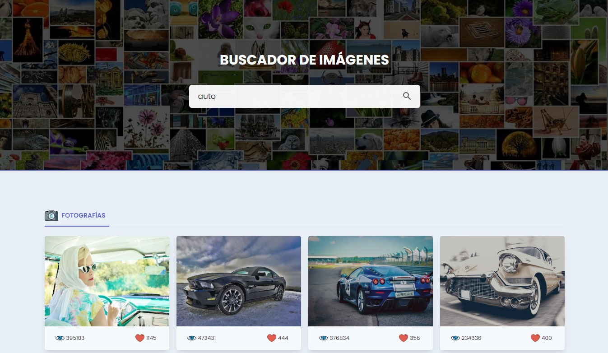

<h2 align="center">Buscador de Imagenes consumiendo la API de Pixabay</h2>

<a href="https://codekasper.github.io/buscador-imagenes"><strong>➥ Live Demo</strong></a>
 

 

### Imagen de Demostración

### Créditos
• Curso de JS Moderno del profesor <a href="https://codigoconjuan.com" target="_blank"><strong>Juan</strong></a>
 
• API de <a href="https://pixabay.com/es/" target="_blank"><strong>Pixabay</strong></a>
 
• Librería de <a href="https://fslightbox.com" target="_blank"><strong>Lightbox</strong></a>

### Contacto

Si quieres contactar conmigo puedes hacerlo desde mi [Sitio Web](https://jotadev.netlify.app/).

### Licencia

Este proyecto es **de uso gratuito** y no contiene ninguna licencia.
